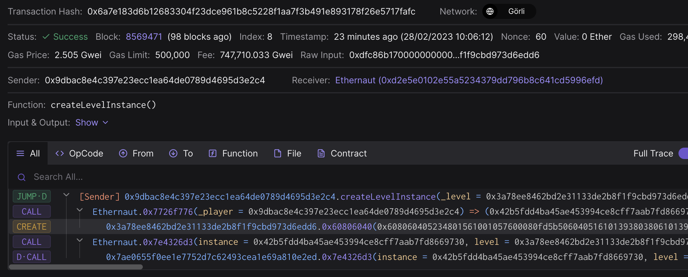

# Vault

> 解锁 vault，走上人生巅峰

```sol
// SPDX-License-Identifier: MIT
pragma solidity ^0.8.0;

contract Vault {
  bool public locked;
  bytes32 private password;

  constructor(bytes32 _password) {
    locked = true;
    password = _password;
  }

  function unlock(bytes32 _password) public {
    if (password == _password) {
      locked = false;
    }
  }
}
```

这道题的解法一目了然，就是读取到password的值然后变更locked状态。

常见的解法有两种

## 从构造中读取

  在合约创建时候的，字节码最后会拼接上构造合约需要的参数，对应到本题，就是`bytes32 _password`.
  在本题中，由于Vault合约是由第三方合约创建，所以直接从etherscan上读取难度较大，这时候我们祭出神器tenderly.

  
  
  从这里可以看到在调用`CREATE`指令时候的字节码，我们读取后64位，即代表了password的参数.

  `412076657279207374726f6e67207365637265742070617373776f7264203a29`
  
 ## 使用ethers.js来读取插槽里面的数据

  所有链上数据都是公开透明的，所以即使是没有被设置为public的数据，我们也可以用`getStorageAt`的方法来进行读取。这里涉及到了solidity的内存分派。
  
  但是就本题而言，我们仅仅需要读取slot1的值就可以了。因为bool和bytes32均占据一个插槽

`await provider2.getStorageAt("0x42B5fdd4Ba45aE453994cE8cff7aAB7fd8669730", 1);`

最后成功解锁了vault，走上了人生巅峰


  
